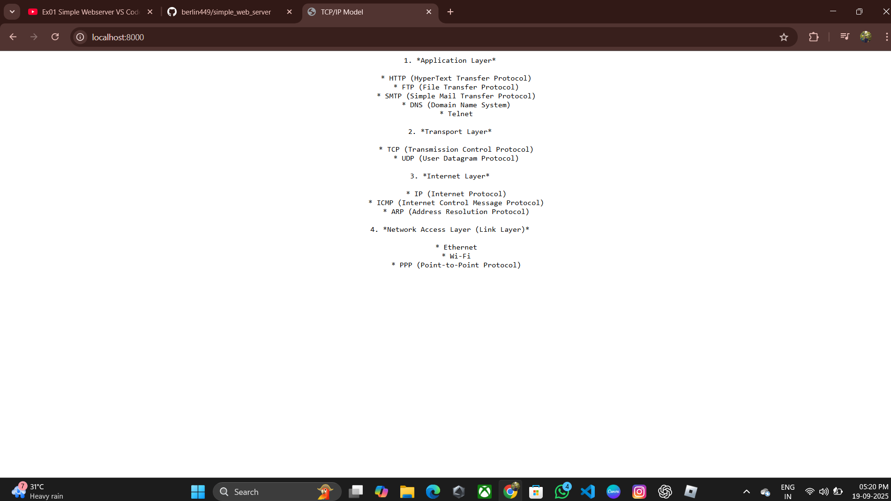
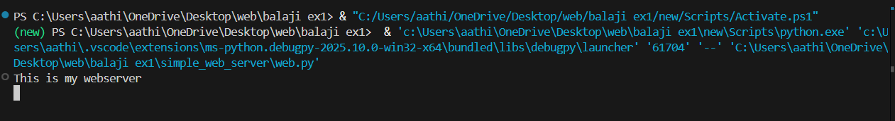

# EX01 Developing a Simple Webserver

# Date:19.09.2025
# AIM:
To develop a simple webserver to serve html pages and display the configuration details of laptop.

# DESIGN STEPS:
## Step 1:
HTML content creation.

## Step 2:
Design of webserver workflow.

## Step 3:
Implementation using Python code.

## Step 4:
Serving the HTML pages.

## Step 5:
Testing the webserver.

# PROGRAM:
```
<html>
<head>
<title>TCP/IP Model</title>
</head>
<body align="center">

<pre>
1. *Application Layer*

   * HTTP (HyperText Transfer Protocol)
   * FTP (File Transfer Protocol)
   * SMTP (Simple Mail Transfer Protocol)
   * DNS (Domain Name System)
   * Telnet

2. *Transport Layer*

   * TCP (Transmission Control Protocol)
   * UDP (User Datagram Protocol)

3. *Internet Layer*

   * IP (Internet Protocol)
   * ICMP (Internet Control Message Protocol)
   * ARP (Address Resolution Protocol)

4. *Network Access Layer (Link Layer)*

   * Ethernet
   * Wi-Fi
   * PPP (Point-to-Point Protocol)
   </pre>
</body>


</html>
```
# OUTPUT:



# RESULT:
The program for implementing simple webserver is executed successfully.

# RESULT:
The program for implementing simple webserver is executed successfully.
